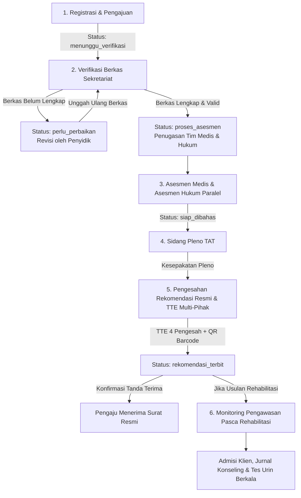

# 📋 ANALISIS ALUR LAYANAN & PERAN PENGGUNA (RBAC) E-TAT SIAP PULIH
**Sistem Integrasi Asesmen dan Pantauan Pemulihan BNNP Kalimantan Timur**

> [!NOTE]  
> Dokumen ini disusun secara rinci berdasarkan **Proposal E-TAT SIAP PULIH.pdf** untuk menjelaskan alur kerja *end-to-end*, pembagian kewenangan *Role-Based Access Control (RBAC)*, transisi status perkara, matriks pengesahan TTE, hingga pemantauan pasca rehabilitasi.

---

## 📑 DAFTAR ISI
1. [Gambaran Umum Sistem](#-1-gambaran-umum-sistem)
2. [Peran Pengguna & Matriks Hak Akses (RBAC)](#-2-peran-pengguna--matriks-hak-akses-rbac)
3. [Alur Layanan Utama (End-to-End Workflow)](#-3-alur-layanan-utama-end-to-end-workflow)
   - [Tahap 1: Registrasi & Pengajuan Permohonan](#tahap-1-registrasi--pengajuan-permohonan)
   - [Tahap 2: Verifikasi Administrasi & Berkas](#tahap-2-verifikasi-administrasi--berkas)
   - [Tahap 3: Asesmen Medis & Asesmen Hukum](#tahap-3-asesmen-medis--asesmen-hukum)
   - [Tahap 4: Sidang Pleno TAT](#tahap-4-sidang-pleno-tat)
   - [Tahap 5: Pengesahan & Penerbitan Rekomendasi (Acuan Visual 8)](#tahap-5-pengesahan--penerbitan-rekomendasi-acuan-visual-8)
   - [Tahap 6: Monitoring Pengawasan Pasca Rehabilitasi](#tahap-6-monitoring-pengawasan-pasca-rehabilitasi)
4. [Integritas Data, Keamanan & Audit Trail](#-4-integritas-data-keamanan--audit-trail)

---

## 🏛️ 1. GAMBARAN UMUM SISTEM

**E-TAT SIAP PULIH** adalah sistem aplikasi berbasis web yang dirancang sebagai ruang kerja digital terpadu bagi Tim Asesmen Terpadu (TAT) BNNP Kalimantan Timur. Aplikasi ini menghubungkan seluruh pihak terkait (*multi-stakeholder*):
- **Kepolisian Negara Republik Indonesia** (Sat Resnarkoba Polresta/Polres)
- **Badan Narkotika Nasional Provinsi (BNNP) Kalimantan Timur**
- **Kejaksaan Negeri / Kanwil Kemenkumham**
- **Tim Medis & Dokter Asesor**
- **Balai / Lembaga Rehabilitasi Narkotika**

Aplikasi ini mengawal seluruh siklus hidup perkara penyalahguna/korban narkotika, mulai dari penerimaan berkas permohonan, verifikasi kelengkapan, pemeriksaan medis & hukum, pembacaan hasil pada Sidang Pleno, penerbitan Surat Rekomendasi Resmi bertanda tangan elektronik (TTE berjenjang), hingga pemantauan kepatuhan rehabilitasi pasca TAT.

---

## 👥 2. PERAN PENGGUNA & MATRIKS HAK AKSES (RBAC)

Sesuai **Proposal Halaman 8 (Bagian 04)**, pembagian hak akses diatur ketat berdasarkan kewenangan tugas kedinasan (*Role-Based Access Control*):

| Peran (Role) | Pengguna Utama | Tugas Utama | Batas Kewenangan & Aturan Akses |
| :--- | :--- | :--- | :--- |
| **Pemohon / Penyidik** | Penyidik Sat Resnarkoba (Polri) / BNN | Mengajukan permohonan registrasi, mengunggah berkas LP/BAP/BB, mengunggah revisi berkas, serta mengonfirmasi tanda terima surat rekomendasi resmi. | Akses terbatas pada permohonan yang diajukannya sendiri. Tidak dapat melihat isi asesmen medis/hukum sebelum tahap pengesahan. |
| **Sekretariat (Operator/Admin)** | Petugas Sekretariat TAT BNNP Kaltim | Verifikasi administrasi berkas, penugasan tim medis & hukum, penjadwalan pemeriksaan & sidang pleno, mencatat notulensi pleno, dan membuat draf rekomendasi. | Tidak berhak menentukan atau mengubah kesimpulan medis/hukum atas nama dokter/asesor hukum. |
| **Petugas Medis** | Dokter Asesor Medis BNNP / RSUD / Klinik | Melakukan pemeriksaan fisik & psikis, input instrumen ASSIST/DSM-5, serta merumuskan diagnosis & usulan rencana rehabilitasi (rawat jalan/inap). | Hanya dapat mengisi/mengedit kasus yang ditugaskan. Perubahan hasil final wajib mencatatkan riwayat koreksi. |
| **Petugas Hukum** | Asesor Hukum (Kejari / Kepolisian / Kemenkumham) | Menganalisis BAP, legalitas penangkapan, kualifikasi peran (pengedar vs korban/penyalahguna), serta merinci data barang bukti laboratorium. | Mengakses berkas hukum dan ringkasan medis sesuai izin akses penugasan perkara. |
| **Koordinator / Pimpinan** | Ketua TAT BNNP Kaltim & Pimpinan BNNP/Polda | Memimpin & memfinalisasi Sidang Pleno, menyetujui surat rekomendasi resmi berjenjang (TTE), serta memantau statistik SLA di Dashboard. | Pimpinan memiliki akses baca (monitoring/viewer); Ketua/Koordinator memiliki hak sah memfinalisasi & menyetujui rekomendasi. |
| **Petugas Pemantauan** | Konselor / Petugas Balai Rehabilitasi | Mencatat rujukan fasilitas (misal Balai Tanah Merah/Lido), konfirmasi admisi klien, jurnal konseling, dan pemantauan tes urin berkala pasca TAT. | Penugasan tambahan pasca rekomendasi; tidak dapat mengubah isi atau hasil rekomendasi asesmen yang telah terbit. |

---

## 🔄 3. ALUR LAYANAN UTAMA (END-TO-END WORKFLOW)

---

### 📍 Tahap 1: Registrasi & Pengajuan Permohonan
- **Pelaksana**: Penyidik Pengaju (Sat Resnarkoba) / Operator.
- **Menu**: `Permohonan & Registrasi Perkara`.
- **Proses Kerja**:
  1. Pengisian formulir bertahap:
     - **Identitas Terperiksa**: NIK, Nama Lengkap, Tempat/Tanggal Lahir, Usia, Alamat KTP & Domisili, Kontak Wali.
     - **Data Perkara**: Nomor Laporan Polisi (LP), Instansi Penyidik, Nama & Kontak Penyidik, Pasal Dipersangkakan, TKP, Kronologi Singkat.
     - **Data Barang Bukti**: Jenis Zat (Metamfetamina, THC, MOP, dll.), Berat Netto/Bruto, Nomor Surat Lab Puslabfor, Status Uji Lab.
     - **Unggah Dokumen Persyaratan**: Surat Permohonan TAT, LP, BAP Sakit/Saksi, SKHPN, Hasil Uji Lab.
  2. Pengiriman permohonan ke sistem.
- **Output**: Permohonan terbuat dengan status `menunggu_verifikasi` dan menerbitkan Nomor Registrasi unik (`TAT/YYYY/MM/XXXX`).

---

### 📍 Tahap 2: Verifikasi Administrasi & Berkas
- **Pelaksana**: Petugas Sekretariat TAT.
- **Menu**: `Verifikasi Administrasi`.
- **Proses Kerja**:
  1. Petugas Sekretariat membuka berkas permohonan dan melakukan checklist keterbacaan serta kesesuaian dokumen.
  2. **Dua Jalur Transisi**:
     - ❌ **Perlu Perbaikan (Revisi)**: Sekretariat mengisi catatan perbaikan & memilih dokumen yang harus diperbaiki. Status berubah menjadi `perlu_perbaikan`. Penyidik menerima pemberitahuan dan mengunggah versi perbaikan.
     - ✅ **Berkas Lengkap**: Berkas disetujui. Status berubah menjadi `diterima_lengkap` / `proses_asesmen`.
  3. Sekretariat menugaskan Dokter Medis & Asesor Hukum, serta memplot jadwal pemeriksaan klinis.

---

### 📍 Tahap 3: Asesmen Medis & Asesmen Hukum
- **Pelaksana**: Tim Dokter Medis & Tim Asesor Hukum (Berjalan Paralel/Berurutan).
- **Menu**: `Asesmen Medis` & `Asesmen Hukum`.
- **Proses Kerja**:
  1. **Tim Medis**: Melakukan tes klinis, skrining instrumen ASSIST (skor keparahan 0–39), pemeriksaan komplikasi fisik/psikatis, dan menyusun diagnosis serta rekomendasi rencana terapi (rawat jalan/inap).
  2. **Tim Hukum**: Menganalisis BAP, legalitas penangkapan, kualifikasi peran (pengedar vs penyalahguna murni/korban), serta menguji ambang batas barang bukti sesuai SEMA No. 4 Tahun 2010 & UU No. 35 Tahun 2009.
- **Output**: Formulir Asesmen Medis dan Hukum terisi lengkap dengan status `siap_dibahas`.

---

### 📍 Tahap 4: Sidang Pleno TAT
- **Pelaksana**: Forum Terpadu (Koordinator, Asesor Medis, Asesor Hukum, Penyidik, Sekretariat).
- **Menu**: `Sidang TAT / Pleno`.
- **Proses Kerja**:
  1. Tim Terpadu melakukan penelaahan bersama atas temuan medis dan analisis hukum.
  2. Sekretariat mencatat notulensi sidang, absensi kehadiran, dan merumuskan draf kesimpulan pleno.
  3. Pengambilan kesepakatan final mengenai bentuk rekomendasi (Rehabilitasi Rawat Inap / Rawat Jalan / Lanjut Proses Hukum).
- **Output**: Berita Acara Pleno disahkan dan status bergerak ke `pengesahan_rekomendasi`.

---

### 📍 Tahap 5: Pengesahan & Penerbitan Rekomendasi (Acuan Visual 8)
- **Pelaksana**: Koordinator TAT, Tim Medis, Tim Hukum, Penyidik.
- **Menu**: `Rekomendasi & TTE Resmi`.
- **Tampilan Layar 3-Panel (Acuan Visual 8)**:
  - 🟩 **Panel Kiri (Rekomendasi Tim Asesmen Terpadu)**:
    - Nomor Rekomendasi Resmi (misal `R/2026/03/08/000074`).
    - Keputusan: Card Hijau Formal **`[✓] DISETUJUI - Rekomendasi Positif`**.
    - Opsi Rekomendasi: (x) Rekomendasi Positif, ( ) Positif dengan Catatan, ( ) Negatif.
    - TTD Digital Ketua Tim (`KOMBES POL. ANDI PRATAMA, S.I.K., M.H.`).
    - Tombol Aksi **`✍️ Proses TTE & Finalisasi`**.
  - 📄 **Panel Tengah (Preview Dokumen Hasil Asesmen PDF)**:
    - Lembar Kertas Putih (Paper View) Kop Resmi `KEPOLISIAN NEGARA REPUBLIK INDONESIA` / `BNNP KALIMANTAN TIMUR`.
    - Judul: **HASIL ASESMEN TERPADU**.
    - Outline Struktur Dokumen I s.d. IX (Identitas Pemohon, Dasar, Ruang Lingkup, Metodologi, Hasil Per Bidang, Temuan & Catatan, Rekomendasi TAT, Keputusan, Penutup).
    - Footer TTD Ketua Tim + **Barcode QR Code Verifikasi** Keaslian (`https://e-tat.polri.go.id/verify`).
  - 🛡️ **Panel Kanan (Keamanan & Audit Trail)**:
    - 7 Indikator Keamanan (Login 2FA/MFA, RBAC, Enkripsi End-to-End, Immutable Audit Trail, Backup & Recovery, QR Code Verifikasi, Tanda Tangan Elektronik Tersertifikasi).
- **Pengesahan Multi-Pihak**: Berkas disahkan oleh 4 Pengesah (Dokter Medis, Asesor Hukum, Penyidik Pengaju, dan Ketua TAT).
- **Konfirmasi Tanda Terima**: Penyidik mengonfirmasi receipt penerimaan berkas fisik/digital (`buktiPenerimaanPengaju`).

---

### 📍 Tahap 6: Monitoring Pengawasan Pasca Rehabilitasi
- **Pelaksana**: Petugas Rehabilitasi / Konselor / Pengawas Pasca TAT.
- **Menu**: `Monitoring / Pengawasan Pasca TAT`.
- **Proses Kerja**:
  1. Apabila rekomendasi adalah **Rehabilitasi**: Sekretariat menerbitkan rujukan ke Balai Rehabilitasi Tujuan (misal Balai Besar BNN Tanah Merah / Loka Lido).
  2. Balai Rehabilitasi melakukan konfirmasi admisi penerimaan klien.
  3. Konselor / Petugas Pengawas mencatat Jurnal Pengawasan (sesi konseling berkala), Skrining Tes Urin Periodik (5 Parameter: AMP, MET, THC, BZO, MOP), serta memantau tingkat kepatuhan program (SLA 3 s.d. 6 bulan).
- **Output**: Rekapitulasi pemantauan pemulihan klien yang terikat secara historis dengan permohonan TAT asal.

---

## 🔒 4. INTEGRITAS DATA, KEAMANAN & AUDIT TRAIL

Sistem **E-TAT SIAP PULIH** menerapkan 3 prinsip utama integritas data kedinasan:

> [!IMPORTANT]  
> **1. Immutable Audit Trail**  
> Seluruh aktivitas pengguna (login, pengajuan, verifikasi, koreksi, pengesahan TTE, hingga pencatatan tes urin) tersimpan secara permanen pada log audit dengan metadata `Timestamp`, `Nama Actor`, `Peran`, `Aksi`, dan `Hash Key`. Catatan audit **tidak dapat diubah atau dihapus**.

> [!TIP]  
> **2. Koreksi Berkas Berversi (Document Versioning)**  
> Apabila berkas dikembalikan untuk perbaikan, pengunggahan ulang tidak menimpa dokumen lama secara diam-diam. Sistem menyimpan seluruh riwayat revisi sehingga rekam jejak verifikasi terdahulu tetap terlindungi secara hukum.

> [!NOTE]  
> **3. Pemisahan Status Asesmen & Pemulihan**  
> Status penyelesaian asesmen terpadu (`rekomendasi_terbit`) dicatat terpisah dari status pemantauan pemulihan (`diterima_fasilitas` / `klien_mulai_layanan`), sehingga progres rehabilitasi tidak mengaburkan kewajiban kepastian hukum pada tahap penyidikan.
