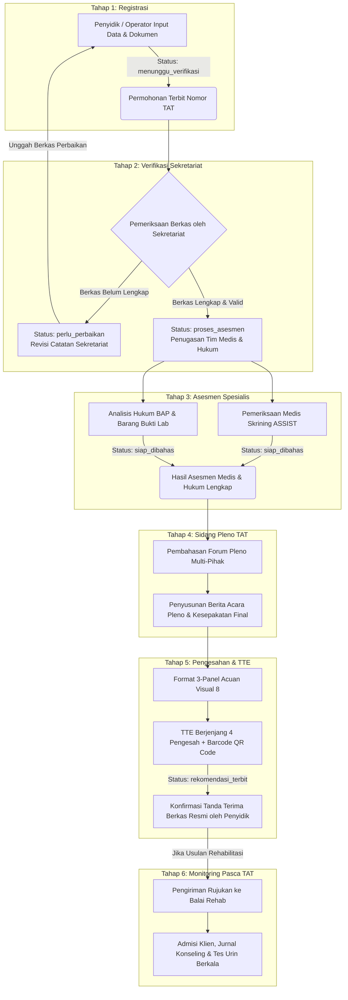

# 📜 STRUKTUR ROLE & ALUR LAYANAN E-TAT SIAP PULIH
**Sistem Integrasi Asesmen dan Pantauan Pemulihan BNNP Kalimantan Timur**

> [!NOTE]  
> Dokumen ini disusun secara independen berdasarkan **Proposal E-TAT SIAP PULIH.pdf (Halaman 8 - 25)** untuk menguraikan rincian jumlah Peran Pengguna (*User Roles*), Matriks Hak Akses (RBAC), serta pemetaan Alur Kerja (*Workflow*) layanan dari pengajuan permohonan hingga pengawasan pemulihan.

---

## 📑 DAFTAR ISI
1. [Struktur & Jumlah Role Pengguna](#-1-struktur--jumlah-role-pengguna)
2. [Matriks Hak Akses & Batas Kewenangan (RBAC)](#-2-matriks-hak-akses--batas-kewenangan-rbac)
3. [Alur Layanan Terpadu (Workflow End-to-End)](#-3-alur-layanan-terpadu-workflow-end-to-end)
4. [Pemetaan Role Pada Setiap Tahap Layanan](#-4-pemetaan-role-pada-setiap-tahap-layanan)
5. [Struktur Output Rekomendasi & Audit Trail](#-5-struktur-output-rekomendasi--audit-trail)

---

## 👥 1. STRUKTUR & JUMLAH ROLE PENGGUNA

Berdasarkan analisis dokumen **Proposal Halaman 8 & 9 (Bagian 04: Peran pengguna dan pembagian kewenangan)**, aplikasi E-TAT SIAP PULIH mendefinisikan total **7 Peran Pengguna**, yang terdiri dari **5 Peran Utama** (dalam tabel acuan) dan **2 Peran/Akses Khusus** (dalam penjelasan operasional).

```
 ┌────────────────────────────────────────────────────────────────────────┐
 │                      TOTAL 7 ROLE PENGGUNA                             │
 ├────────────────────────────────────────┬───────────────────────────────┤
 │ 5 PERAN UTAMA (Tabel Halaman 8)        │ 2 PERAN KHUSUS (Hal 8-9)      │
 ├────────────────────────────────────────┼───────────────────────────────┤
 │ 1. Administrator / Operator            │ 6. Pemohon / Penyidik Pengaju │
 │ 2. Tim Medis (Dokter Asesor)           │ 7. Ketua TAT / Koordinator    │
 │ 3. Tim Hukum (Asesor Hukum)            │                               │
 │ 4. Pimpinan / Executive Viewer         │                               │
 │ 5. Petugas Pemantauan (Rehabilitasi)   │                               │
 └────────────────────────────────────────┴───────────────────────────────┘
```

---

## 🛡️ 2. MATRIKS HAK AKSES & BATAS KEWANANGAN (RBAC)

 Sesuai prinsip *Role-Based Access Control*, menyembunyikan menu saja belum cukup; setiap akses data dan berkas diperiksa secara ketat menurut fungsi kedinasan:

| No | Peran (Role) | Kategori | Pengguna Pelaksana | Ruang Lingkup Tugas | Batas Kewenangan & Aturan Akses |
| :-: | :--- | :--- | :--- | :--- | :--- |
| **1** | **Administrator / Operator** | Peran Utama | Petugas Sekretariat TAT BNNP Kaltim | Pengelolaan akun, registrasi permohonan, verifikasi berkas, penugasan tim, jadwal pleno, dan status administrasi. | tidak berhak menyusun atau mengedit kesimpulan medis/hukum atas nama dokter/asesor. |
| **2** | **Tim Medis** | Peran Utama | Dokter Asesor Medis (BNNP / RSUD / Klinik) | Skrining klinis (ASSIST), diagnosis tingkat ketergantungan, dan usulan rencana rehabilitasi (rawat jalan/inap). | Hanya dapat mengisi/mengedit kasus yang ditugaskan; perubahan hasil final wajib tercatat di audit log. |
| **3** | **Tim Hukum** | Peran Utama | Asesor Hukum (Kejari / Kepolisian / Kemenkumham) | Analisis BAP, legalitas penangkapan, kualifikasi peran (pengedar vs korban), dan analisis barang bukti lab. | Mengakses berkas hukum dan ringkasan medis sesuai izin penugasan perkara. |
| **4** | **Pimpinan / Viewer** | Peran Utama | Kepala BNNP / Kapolda / Dir Resnarkoba | Pemantauan dashboard statistik, progres perkara, SLA operasional, dan rekapitulasi laporan eksekutif. | Akses baca (*read-only*); tidak memiliki kewenangan mengubah substansi asesmen atau kesimpulan. |
| **5** | **Petugas Pemantauan** | Peran Utama | Konselor / Petugas Balai Rehabilitasi | Pengelolaan rujukan, konfirmasi admisi, pencatatan jurnal konseling, dan skrining tes urin berkala pasca TAT. | Penugasan tambahan pasca rekomendasi; tidak dapat mengubah isi surat rekomendasi yang telah terbit. |
| **6** | **Pemohon / Penyidik** | Peran Khusus | Penyidik Sat Resnarkoba Polresta/Polres | Registrasi awal permohonan, melampirkan berkas LP/BAP/BB, mengunggah revisi, dan menandatangani tanda terima. | Akses terbatas pada permohonan yang diajukannya sendiri. Tidak dapat melihat draf internal medis/hukum. |
| **7** | **Ketua / Koordinator** | Peran Khusus | Pejabat Ketua Tim Asesmen Terpadu | Memimpin Sidang Pleno, memfinalisasi musyawarah pleno, dan memvalidasi pengesahan rekomendasi via TTE. | Hak sah memfinalisasi kesepakatan pleno dan menandatangani surat rekomendasi resmi berjenjang. |

---

## 🔄 3. ALUR LAYANAN TERPADU (WORKFLOW END-TO-END)

Alur kerja aplikasi mengikuti **6 Tahap Berurutan** (Proposal Halaman 9–24):



---

## 📌 4. PEMETAAN ROLE PADA SETIAP TAHAP LAYANAN

Berikut adalah rincian interaksi peran pengguna pada tiap tahapan proses:

### 🔹 Tahap 1: Registrasi & Pengajuan Permohonan
- **Pelaksana Utama**: `Pemohon / Penyidik Pengaju` atau `Administrator / Operator`.
- **Aktivitas**:
  - Input Identitas Terperiksa (NIK, Nama, Tanggal Lahir, Alamat, Wali).
  - Input Data Perkara (Nomor LP, Tanggal LP, TKP, Kronologi).
  - Input Data Barang Bukti (Jenis zat, berat netto/bruto, nomor lab Puslabfor).
  - Mengunggah Dokumen Persyaratan (Surat Permohonan TAT, LP, BAP, SKHPN, Lab BB).
- **Status Transisi**: `menunggu_verifikasi`.

### 🔹 Tahap 2: Verifikasi Administrasi & Penugasan
- **Pelaksana Utama**: `Administrator / Operator` (Sekretariat TAT).
- **Aktivitas**:
  - Membuka berkas permohonan dan mengecek checklist keabsahan dokumen.
  - **Cabang Revisi**: Jika tidak lengkap ➔ Set status `perlu_perbaikan` + catatan revisi. Penyidik mengunggah berkas baru.
  - **Cabang Setuju**: Jika valid ➔ Set status `diterima_lengkap` / `proses_asesmen`.
  - Penugasan Dokter Medis, Asesor Hukum, dan plotting Jadwal Pemeriksaan.
- **Status Transisi**: `perlu_perbaikan` ATAU `proses_asesmen`.

### 🔹 Tahap 3: Pelaksanaan Asesmen Medis & Asesmen Hukum
- **Pelaksana Utama**: `Tim Medis` (Dokter Asesor) & `Tim Hukum` (Asesor Hukum).
- **Aktivitas**:
  - **Tim Medis**: Input riwayat pengunaan, tes klinis, skor ASSIST (0-39), diagnosis komplikasi, dan usulan rawat jalan/inap.
  - **Tim Hukum**: Input kualifikasi peran (pengedar vs korban/penyalahguna), pengujian ambang batas SEMA No. 4/2010, dan rekomendasi aspek hukum.
- **Status Transisi**: `siap_dibahas`.

### 🔹 Tahap 4: Sidang Pleno TAT & Berita Acara
- **Pelaksana Utama**: `Ketua / Koordinator`, `Tim Medis`, `Tim Hukum`, `Administrator / Operator`, `Pemohon / Penyidik`.
- **Aktivitas**:
  - Penelaahan bersama temuan medis dan analisis hukum dalam forum pleno.
  - Operator mencatat notulensi, daftar hadir, dan draf berita acara.
  - Ketua TAT memimpin musyawarah penetapan simpulan akhir.
- **Status Transisi**: `pengesahan_rekomendasi`.

### 🔹 Tahap 5: Penerbitan Rekomendasi Resmi & TTE Multi-Pihak (Acuan Visual 8)
- **Pelaksana Utama**: `Ketua / Koordinator`, `Tim Medis`, `Tim Hukum`, `Pemohon / Penyidik`.
- **Tampilan 3-Panel Acuan Visual 8**:
  1. **Panel Kiri**: Opsi Keputusan (Positif/Catatan/Negatif), TTD digital Ketua Tim, Tombol *Proses TTE & Finalisasi*.
  2. **Panel Tengah**: PDF Preview Resmi (Bagian I-IX) + **Barcode QR Code Verifikasi** (`https://e-tat.polri.go.id/verify`).
  3. **Panel Kanan**: Keamanan & Audit Trail (2FA, RBAC, Enkripsi, Log Immutable).
- **Aktivitas TTE**: Pengesahan 4 Pihak (Asesor Medis, Asesor Hukum, Penyidik Pengaju, Ketua TAT).
- **Konfirmasi Terima**: Penyidik mengonfirmasi tanda terima berkas (`buktiPenerimaanPengaju`).
- **Status Transisi**: `rekomendasi_terbit` / `statusDokumen: resmi_terbit`.

### 🔹 Tahap 6: Monitoring Pengawasan Pasca Rehabilitasi
- **Pelaksana Utama**: `Petugas Pemantauan` (Konselor / Balai Rehabilitasi).
- **Aktivitas**:
  - Penerbitan rujukan ke lembaga rehabilitasi (misal Balai Tanah Merah / Loka Lido).
  - Konfirmasi admisi penerimaan klien oleh fasilitas.
  - Pencatatan Jurnal Konseling Berkala, Tes Urin Periodik (5 Parameter), dan evaluasi kepatuhan program (SLA 3-6 Bulan).
- **Status Transisi**: `diterima_fasilitas` ➔ `klien_mulai_layanan` ➔ `selesai_tindak_lanjut`.

---

## 🔒 5. STRUKTUR OUTPUT REKOMENDASI & AUDIT TRAIL

Sistem menjamin integritas legalitas dokumen melalui:
1. **QR Code Verification**: Setiap lembar rekomendasi PDF dilengkapi QR Code unik yang dapat dipindai secara terbuka untuk memverifikasi keaslian dokumen di server resmi.
2. **Multi-Signer TTE Matrix**: Menampilkan status tanda tangan elektronik tersertifikasi dari 4 pihak beserta hash digitalnya.
3. **Immutable Audit Trail**: Catatan kronologis otomatis yang menyimpan *Timestamp*, *Pelaksana*, *Role*, *Aksi*, dan *Metadata* tanpa dapat diubah atau dihapus oleh pihak manapun.
